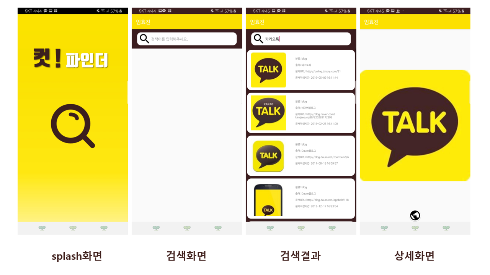
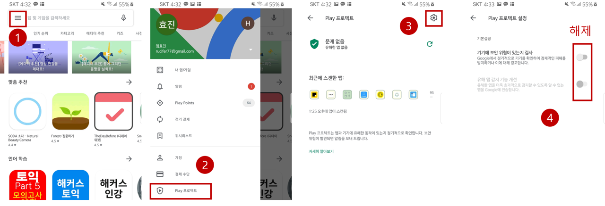

## **임효진 - Kakao-Pay-Image-Search**

카카오페이 사전과제:  카카오 검색API 사용하기



------

### **Introduction**

- 사용언어: Java
- 개발IDE: Android Studio

- APK 다운로드: <https://drive.google.com/drive/u/0/folders/1mWYtyex-LLLP-k3vk4RnEZIZ_Qm5djIJ>

------

### 설치가 안된다면?

**: 보안 문제로 설치가 안될수 있으니 하단을 참고해주세요**


<hr>

### **Implementation**

##### **Detail**

- 이미지 검색 API : 카카오 Restfull API 중 이미지 검색 api 사용 
- 검색 결과: list (RecyclerView사용)로 구현
- 검색 키워드: 사용자가 지워서 수정가능
- 이미지 클릭시 상세화면: 이미지가 로드되고 하단에 버튼 클릭시 문서 본문으로 이동
- Toolbar 구성: 왼쪽에 이름 위치


**Development Environment**

```
compileSdkVersion 28
minSdkVersion 26
targetSdkVersion 28
AndroidStudio 3.4.2
```


##### **Dependency**

```
// Support Library
implementation 'com.android.support:design:28.0.0'
implementation 'com.android.support:recyclerview-v7:28.0.0'


// Glide
implementation 'com.github.bumptech.glide:glide:4.9.0'
annotationProcessor 'com.github.bumptech.glide:compiler:4.9.0'

// Retrofit2
implementation 'com.squareup.retrofit2:retrofit:2.6.1'
implementation 'com.squareup.retrofit2:converter-gson:2.6.1'

// OkHttp3
implementation 'com.squareup.okhttp3:okhttp:4.0.1'
implementation 'com.squareup.okhttp3:logging-interceptor:4.0.1'

// RxJava2
implementation 'io.reactivex.rxjava2:rxjava:2.2.11'
implementation 'io.reactivex.rxjava2:rxandroid:2.1.1'
```


##### **아이콘 및 splash화면**

- splash화면 글씨체

  - Tmon몬소리 Black

  - 나눔손글씨붓

- search_icon

  - https://material.io/resources/icons/?icon=search&style=outline

- 그외

  - 직접 제작

